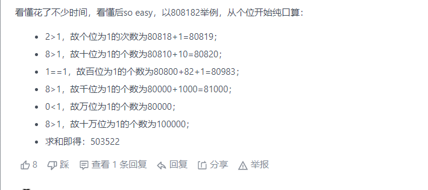
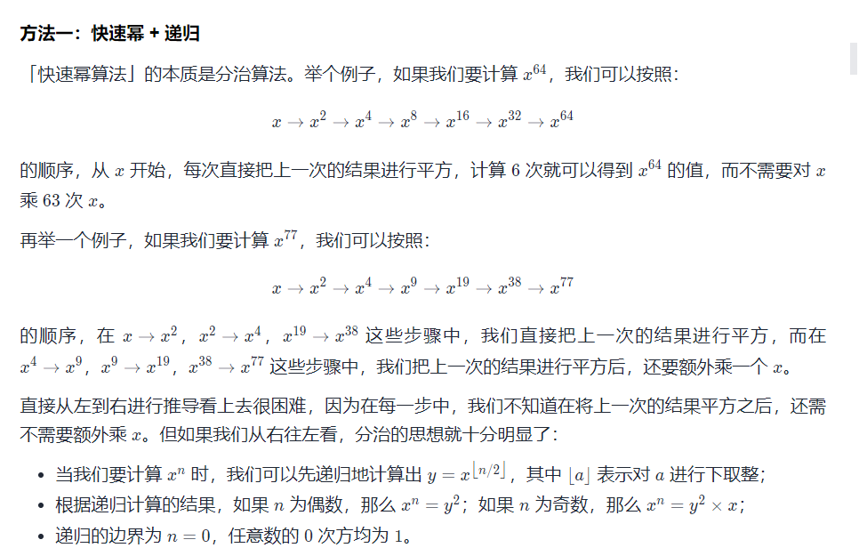
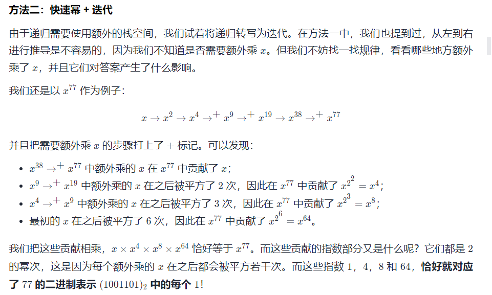
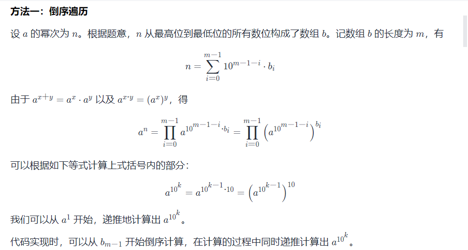
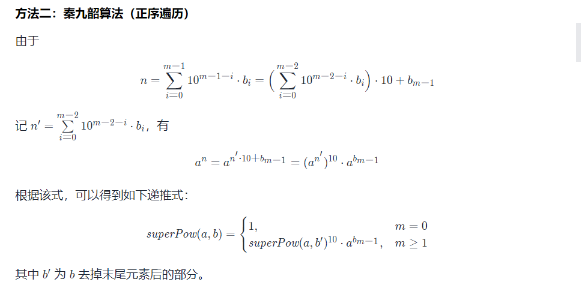

#### [7. 整数反转](https://leetcode-cn.com/problems/reverse-integer/)

注意边界条件

```C++
class Solution {
public:
    int reverse(int x) {
        int result=0, digit;
        while(x != 0) 
        {
            if(result < INT_MIN / 10 || result > INT_MAX / 10) 
                return 0;
            digit = x % 10;
            x /= 10;
            result = result * 10 + digit;
        }
        return result;
    }
};
```

#### [9. 回文数](https://leetcode-cn.com/problems/palindrome-number/)

设置列表保存各位数字

```C++
class Solution {
public:
    bool isPalindrome(int x) {
        if(x < 0)
            return false;
        vector<int> list;
        while(x != 0)
        {
            list.push_back(x % 10);
            x /= 10;
        }
        int lenth = list.size();
        for(int i=0; i<lenth/2; i++)
        {
            if(list[i] != list[lenth - i - 1])
                return false;
        }
        return true;
    }
};
```

#### [479. 最大回文数乘积(*)](https://leetcode-cn.com/problems/largest-palindrome-product/)

丑陋穷举法

```C++
class Solution {
public:
    int largestPalindrome(int n) {
        switch(n)
        {
            case 1:return 9;
            case 2:return 987;
            case 3:return 123;
            case 4:return 597;
            case 5:return 677;
            case 6:return 1218;
            case 7:return 877;
            case 8:return 475;
            default:return 0;
        }
    }
};
```

#### [564. 寻找最近的回文数(*)](https://leetcode-cn.com/problems/find-the-closest-palindrome/)

```java
public class Solution {
    public String mirroring(String s) {
        String x = s.substring(0, (s.length()) / 2);
        return x + (s.length() % 2 == 1 ? s.charAt(s.length() / 2) : "") + new StringBuilder(x).reverse().toString();
    }
    public String nearestPalindromic(String n) {
        if (n.equals("1"))
            return "0";

        String a = mirroring(n);
        long diff1 = Long.MAX_VALUE;
        diff1 = Math.abs(Long.parseLong(n) - Long.parseLong(a));
        if (diff1 == 0)
            diff1 = Long.MAX_VALUE;

        StringBuilder s = new StringBuilder(n);
        int i = (s.length() - 1) / 2;
        while (i >= 0 && s.charAt(i) == '0') {
            s.replace(i, i + 1, "9");
            i--;
        }
        if (i == 0 && s.charAt(i) == '1') {
            s.delete(0, 1);
            int mid = (s.length() - 1) / 2;
            s.replace(mid, mid + 1, "9");
        } else
            s.replace(i, i + 1, "" + (char)(s.charAt(i) - 1));
        String b = mirroring(s.toString());
        long diff2 = Math.abs(Long.parseLong(n) - Long.parseLong(b));


        s = new StringBuilder(n);
        i = (s.length() - 1) / 2;
        while (i >= 0 && s.charAt(i) == '9') {
            s.replace(i, i + 1, "0");
            i--;
        }
        if (i < 0) {
            s.insert(0, "1");
        } else
            s.replace(i, i + 1, "" + (char)(s.charAt(i) + 1));
        String c = mirroring(s.toString());
        long diff3 = Math.abs(Long.parseLong(n) - Long.parseLong(c));

        if (diff2 <= diff1 && diff2 <= diff3)
            return b;
        if (diff1 <= diff3 && diff1 <= diff2)
            return a;
        else
            return c;
    }
}
```

#### [231. 2 的幂](https://leetcode-cn.com/problems/power-of-two/)

注意到操作`n & (n-1)`是将`n`二进制最低位的1移除。

```C++
class Solution {
    public boolean isPowerOfTwo(int n) {
        return (n > 0) && (n & (n-1)) == 0;
    }
}
```

#### [342. 4的幂](https://leetcode-cn.com/problems/power-of-four/)

同上题类似，首先是2的幂，然后1的位置要在奇数位，可以使用`0xA = 1010b`或者`0x5 = 0101b`来进行校验

```C++
class Solution {
public:
    bool isPowerOfFour(int n) {
        return (n > 0) && (n & (n-1)) == 0 && (n & 0x55555555) != 0;
    }
};
```

#### [326. 3 的幂](https://leetcode-cn.com/problems/power-of-three/)

```C++
class Solution {
public:
    bool isPowerOfThree(int n) {
        if(n <= 0)
            return false;
        while(n != 1)
        {
            if(n % 3 != 0)
                return false;
            n /= 3;
        }
        return true;
    }
};
```

#### [504. 七进制数](https://leetcode-cn.com/problems/base-7/)

```C++
class Solution {
public:
    string convertToBase7(int num) {
        if(num == 0)
            return "0";
        string result = "";
        bool negflag = (num < 0) ? true : false;
        num = abs(num);
        while(num > 0)
        { 
            result += num % 7 + '0';
            num /= 7;
        }
        if(negflag)
            result += '-';
        reverse(result.begin(), result.end());
        return result;
    }
};
```

#### [263. 丑数](https://leetcode-cn.com/problems/ugly-number/)

当`n<=0`时不是丑数

否则，当n不为1时，判断其除以2、3、5的余数，若为零则除之，不断循环。如果都不是，则n不是丑数

```C++
class Solution {
public:
    bool isUgly(int n) {
        if(n <= 0)
            return false;
        while(n != 1)
        {
            if(n % 5 == 0)
                n /= 5;
            else if(n % 3 == 0)
                n /= 3;
            else if(n % 2 == 0)
                n /= 2;
            else
                return false;
        }
        return true;
    }
};
```

#### [190. 颠倒二进制位](https://leetcode-cn.com/problems/reverse-bits/)

逐位添加即可

```C++
class Solution {
public:
    uint32_t reverseBits(uint32_t n) {
        uint32_t result = 0;
        for(int i=0; i<31; i++)
        {
            if((n & 1) != 0)
                result |= 1;
            n = n >> 1;
            result = result << 1;
        }
        if((n & 1) != 0)
            result |= 1;
        return result;
    }
};
```

#### [191. 位1的个数](https://leetcode-cn.com/problems/number-of-1-bits/)

* 逐位检查
* 使用`n&(n-1)`不断去除一个1，直到原数没有1为止

```C++
class Solution {
public:
    int hammingWeight(uint32_t n) {
        int result = 0;
        while(n != 0)
        {
            if((n & 1) != 0)
                result++;
            n = n >> 1;
        }
        return result;
    }
};
class Solution {
public:
    int hammingWeight(uint32_t n) {
        int ret = 0;
        while (n) {
            n &= n - 1;
            ret++;
        }
        return ret;
    }
};
```

#### [476. 数字的补数](https://leetcode-cn.com/problems/number-complement/)

假设`num`至少需要`k`位表示，则令$mask=2^{k+1}-1$，即连续`k`个1，再减去`num`即可

```C++
class Solution {
public:
    int findComplement(int num) {
        uint32_t mask = 1;
        while(mask <= num)
            mask = mask << 1;
        return mask - num - 1;
    }   
};
```

#### [461. 汉明距离](https://leetcode-cn.com/problems/hamming-distance/)

先异或，然后同Q191类似计算1的个数，为了节省空间可以使用输入的x，y作为变量使用

```C++
class Solution {
public:
    int hammingDistance(int x, int y) {
        x ^= y;
        y = 0;
        while(x)
        {
            x = x & (x - 1);
            y++;
        }
        return y;
    }
};
```

#### [477. 汉明距离总和](https://leetcode-cn.com/problems/total-hamming-distance/)

对数组中每个数的第`k`位，假设有`n`个0，则有`lenth-n`个1，在这一位上的汉明距离之和为`n*(lenth-n)`

```C++
class Solution {
public:
    int totalHammingDistance(vector<int>& nums) {
        int result=0, lenth=nums.size();
        uint32_t mask = 1;
        vector<int> count(32, 0);
        for(int i=0; i<32; i++)
        {
            for(int j=0; j<lenth; j++)
                if(nums[j] & mask)
                    count[i]++;
            mask = mask << 1;
        }
        for(int i=0; i<32; i++)
            result += count[i] * (lenth - count[i]);
        return result;
    }
};
```

#### [693. 交替位二进制数](https://leetcode-cn.com/problems/binary-number-with-alternating-bits/)

```C++
class Solution {
public:
    bool hasAlternatingBits(int n) {
        uint32_t temp = n ^ (n >> 1);
        return (temp & (temp + 1)) == 0;
    }
};
```

#### [393. UTF-8 编码验证](https://leetcode-cn.com/problems/utf-8-validation/)

体力劳动

```C++
class Solution {
public:
    bool validUtf8(vector<int>& data) {
        int n = data.size();
        for(auto & d : data){
            d &= 255;
        }

        for(int i=0; i<n; ++i){
            if(data[i] <= 127) continue;
            if(data[i] >= 192 && data[i] < 224){
                i++;
                if(i>=n || data[i] < 128 || data[i] >= 192) return false;
            }
            else if(data[i] >= 224 && data[i] < 240){
                i++;
                if(i>=n || data[i] < 128 || data[i] >= 192) return false;
                i++;
                if(i>=n || data[i] < 128 || data[i] >= 192) return false;
            }
            else if(data[i] >= 240 && data[i] < 248){
                i++;
                if(i>=n || data[i] < 128 || data[i] >= 192) return false;
                i++;
                if(i>=n || data[i] < 128 || data[i] >= 192) return false;
                i++;
                if(i>=n || data[i] < 128 || data[i] >= 192) return false;
            }
            else return false;
        }
        return true;
    }
};
```

#### [172. 阶乘后的零](https://leetcode-cn.com/problems/factorial-trailing-zeroes/)

对于阶乘数来说，2因子的个数一定比5因子多，因此只需要数5因子的个数即可

```C++
class Solution {
public:
    int trailingZeroes(int n) {
        int result=0;
        while(n >= 5)
        {
            result += n/5;
            n /= 5;
        }
        return result;
    }
};
```

#### [458. 可怜的小猪(*)](https://leetcode-cn.com/problems/poor-pigs/)

该问题不关心具体方案。

其实香农已经在《信息论》（[信息熵](https://baike.baidu.com/item/香农熵/1649961)）中给过我们结论了——我们一共可以进行n轮实验：$n=\frac{minutesToTest}{minutesToDie}$

- 经过所有实验，一只小猪能有多少种状态？第一轮就死、第二轮死、...、第n轮死，以及生还，所以一共有n + 1种状态
- n + 1种状态所携带的信息为log_2(n + 1)比特，这也是一只小猪最多提供的信息量
- 而”$buckets$瓶液体中哪一瓶是毒“这件事，也有$buckets$种可能性，所以需要的信息量是$log_2(buckets)$

注：以上所有事件、状态都是先验等概的，所以可以直接对2取对数得到信息熵

因此一定存在一种“合理设计”的实验，使得我们只要有k只猪猪：满足 $k \times log_2(n + 1) \ge log_2(buckets)$时，则我们一定能得到足够的信息量去判断哪一瓶是毒。

```C++
class Solution {
public:
    int poorPigs(int buckets, int minutesToDie, int minutesToTest) {
        int states = minutesToTest / minutesToDie + 1;
        int pigs = ceil(log(buckets) / log(states));
        return pigs;
    }
};
```

#### [258. 各位相加](https://leetcode-cn.com/problems/add-digits/)

以三位数为例，各位数字表示三位数为$n = 100a+10b+c$，各位数之和为$a+b+c$，二者之差为$99a+9b$一定是9的倍数

```C++
class Solution {
public:
    int addDigits(int num) {
        if(num == 0)
            return 0;
        num = num % 9;
        if(num == 0)
            return 9;
        else
            return num;
    }
};
```

#### [319. 灯泡开关(*)](https://leetcode-cn.com/problems/bulb-switcher/)

第i个灯泡的反转次数等于它所有因子（包括1和i）的个数，一开始的状态的灭的，只有反转奇数次才会变成亮的，所以只有因子个数为奇数的灯泡序号才会亮，只有平方数的因子数为奇数（比如$6=1\times6=2\times3$，它们的因子总是成对出现的，而$4=1\times4=2\times2$，只有平方数的平方根因子会只出现1次），所以最终答案等于n以内（包括n和1）的平方数数量，只要计算`sqrt(n)`即可

```C++
class Solution {
public:
    int bulbSwitch(int n) {
        return sqrt(n + 0.5);
    }
};
```

#### [405. 数字转换为十六进制数](https://leetcode-cn.com/problems/convert-a-number-to-hexadecimal/)

注意输入的为整型，而循环中的移位需要逻辑右移

```C++
class Solution {
public:
    string toHex(int num) {
        if(num == 0)
            return "0";
        string result = "";
        uint32_t n = num;
        char temp;
        while(n != 0)
        {
            temp = n & 0xf;
            if(temp <= 9)
                result += temp + '0';
            else
                result += temp + 'a' - 10;
            n = n >> 4;
        }
        reverse(result.begin(), result.end());
        return result;
    }
};
```

#### [171. Excel 表列序号](https://leetcode-cn.com/problems/excel-sheet-column-number/)

```C++
class Solution {
public:
    int titleToNumber(string columnTitle) {
        int result=0, lenth=columnTitle.size();
        for(int i=0; i<lenth-1; i++)
        {
            result += columnTitle[i] - 'A' + 1;
            result *= 26;
        }
        result += columnTitle[lenth - 1] - 'A' + 1;
        return result;
    }
};
```

#### [168. Excel表列名称](https://leetcode-cn.com/problems/excel-sheet-column-title/)

每轮循环要减一

```C++
class Solution {
public:
    string convertToTitle(int columnNumber) {
        string result = "";
        while(columnNumber > 0)
        {
            columnNumber--;
            result += columnNumber % 26 + 'A';
            columnNumber /= 26;
        }
        reverse(result.begin(), result.end());
        return result;
    }
};
```

#### [670. 最大交换](https://leetcode-cn.com/problems/maximum-swap/)

要使得最大的数在最高位上，若最高位是最大数，则判断次高位是否为次大数，依次往下判断

```C++
class Solution {
public:
    int maximumSwap(int num) {
        string str = to_string(num);
        int len = str.size();
        for (int i = 0; i < len - 1; i++)
        {
            char maxBit =str[i];
            int index = 0;
            for (int j = i + 1; j < len; j++)
            {
                if (maxBit <= str[j])
                {
                    maxBit = str[j];
                    index = j;
                }
            }
            if (maxBit != str[i])
            {
                swap(str[i], str[index]);
                return stoi(str);
            }
        }
        return num;
    }
};
```

#### [233. 数字 1 的个数(*)](https://leetcode-cn.com/problems/number-of-digit-one/)



```C++
class Solution {
public:
    int countDigitOne(int n) {
        // mulk 表示 10^k
        // 在下面的代码中，可以发现 k 并没有被直接使用到（都是使用 10^k）
        // 但为了让代码看起来更加直观，这里保留了 k
        long long mulk = 1;
        int ans = 0;
        for (int k = 0; n >= mulk; ++k) {
            ans += (n / (mulk * 10)) * mulk + min(max(n % (mulk * 10) - mulk + 1, 0LL), mulk);
            mulk *= 10;
        }
        return ans;
    }
};
```

#### [357. 计算各个位数不同的数字个数](https://leetcode-cn.com/problems/count-numbers-with-unique-digits/)

对于一个`k`位数，根据排列数原理，最高位不能为零，有9种可能，后面的位从剩下的9个数中选择排列，即$Count=9\times9\times8\times7\times...$

```C++
class Solution {
public:
    int countNumbersWithUniqueDigits(int n) {
        if(n == 0)
            return 1;
        int result=10;
        int temp=9;
        for(int i=0; i<n-1; i++)
        {
            temp = temp * (9 - i);
            result += temp;
        }
        return result;
    }
};
```

#### [400. 第 N 位数字](https://leetcode-cn.com/problems/nth-digit/)

* 第一步，计算n所在的数字属于几位数；
* 第二步，确定n所在的数字；
* 第三步，确定n所代表的位数

```C++
class Solution {
public:
    int findNthDigit(int n) {
        int d = 1, count = 9;
        while (n > (long) d * count) {
            n -= d * count;
            d++;
            count *= 10;
        }
        int index = n - 1;
        int start = (int) pow(10, d - 1);
        int num = start + index / d;
        int digitIndex = index % d;
        int digit = (num / (int) (pow(10, d - digitIndex - 1))) % 10;
        return digit;
    }
};
```

#### [492. 构造矩形](https://leetcode-cn.com/problems/construct-the-rectangle/)

从$\sqrt{area}$开始计算

```C++
class Solution {
public:
    vector<int> constructRectangle(int area) {
        int mid=(int)sqrt(area);
        int L=mid;
        while(area % L != 0)
            L++;
        vector<int> result = {L, area / L};
        if(result[0] < result[1])
            swap(result[0], result[1]);
        return result;
    }
};
```

#### [29. 两数相除(*)](https://leetcode-cn.com/problems/divide-two-integers/)

```C++
class Solution {
public:
    int divide(int dividend, int divisor) {
        // 考虑被除数为最小值的情况
        if (dividend == INT_MIN) {
            if (divisor == 1) {
                return INT_MIN;
            }
            if (divisor == -1) {
                return INT_MAX;
            }
        }
        // 考虑除数为最小值的情况
        if (divisor == INT_MIN) {
            return dividend == INT_MIN ? 1 : 0;
        }
        // 考虑被除数为 0 的情况
        if (dividend == 0) {
            return 0;
        }
        
        // 一般情况，使用类二分查找
        // 将所有的正数取相反数，这样就只需要考虑一种情况
        bool rev = false;
        if (dividend > 0) {
            dividend = -dividend;
            rev = !rev;
        }
        if (divisor > 0) {
            divisor = -divisor;
            rev = !rev;
        }

        vector<int> candidates = {divisor};
        // 注意溢出
        while (candidates.back() >= dividend - candidates.back()) {
            candidates.push_back(candidates.back() + candidates.back());
        }
        int ans = 0;
        for (int i = candidates.size() - 1; i >= 0; --i) {
            if (candidates[i] >= dividend) {
                ans += (1 << i);
                dividend -= candidates[i];
            }
        }

        return rev ? -ans : ans;
    }
};
```

#### [507. 完美数](https://leetcode-cn.com/problems/perfect-number/)

* 从2到$\sqrt{num}$枚举，添加每一对因数
* 穷举，范围内的完美数只有5个

```C++
class Solution {
public:
    bool checkPerfectNumber(int num) {
        if(num == 1)
            return false;
        int sum = 1;
        int i = 2;
        while(i * i <= num)
        {
            if(num % i == 0)
            {
                sum += i;
                if(i * i != num)
                    sum += num / i;
            }
            if(sum > num)
                return false;
            i++;
        }
        return (sum == num);
    }
};
```

#### [50. Pow(x, n)(*)](https://leetcode-cn.com/problems/powx-n/)

快速幂算法



```C++
class Solution {
public:
    double quickMul(double x, long long N) {
        double ans = 1.0;
        // 贡献的初始值为 x
        double x_contribute = x;
        // 在对 N 进行二进制拆分的同时计算答案
        while (N > 0) {
            if (N % 2 == 1) {
                // 如果 N 二进制表示的最低位为 1，那么需要计入贡献
                ans *= x_contribute;
            }
            // 将贡献不断地平方
            x_contribute *= x_contribute;
            // 舍弃 N 二进制表示的最低位，这样我们每次只要判断最低位即可
            N /= 2;
        }
        return ans;
    }

    double myPow(double x, int n) {
        long long N = n;
        return N >= 0 ? quickMul(x, N) : 1.0 / quickMul(x, -N);
    }
};
```

#### [372. 超级次方(*)](https://leetcode-cn.com/problems/super-pow/)



```C++
class Solution {
    const int MOD = 1337;

    int pow(int x, int n) {
        int res = 1;
        while (n) {
            if (n % 2) {
                res = (long) res * x % MOD;
            }
            x = (long) x * x % MOD;
            n /= 2;
        }
        return res;
    }

public:
    int superPow(int a, vector<int> &b) {
        int ans = 1;
        for (int i = b.size() - 1; i >= 0; --i) {
            ans = (long) ans * pow(a, b[i]) % MOD;
            a = pow(a, 10);
        }
        return ans;
    }
};
```


