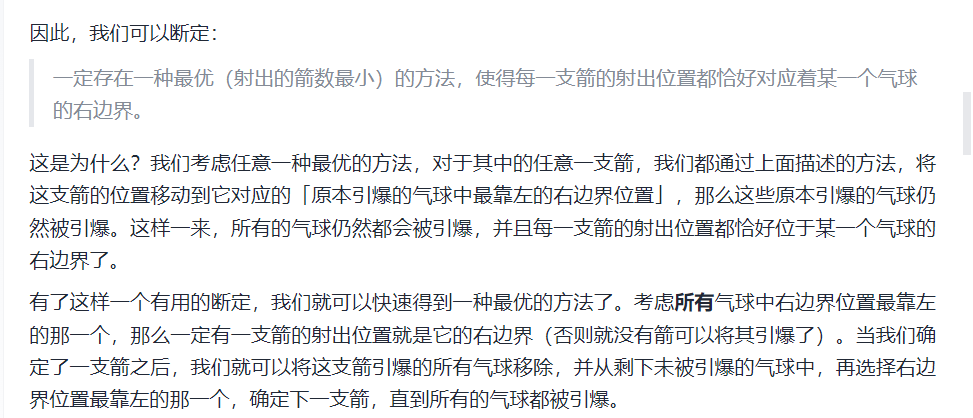

#### [605. 种花问题](https://leetcode-cn.com/problems/can-place-flowers/)

贪心算法，在原数组头尾各加一个0，遍历数组，若该位置前后及其自己都是零，则将其置一，表示这里可以种一朵花

```python
class Solution:
    def canPlaceFlowers(self, flowerbed: List[int], n: int) -> bool:
        if n == 0:
            return True
        temp = [0] + flowerbed + [0]
        count = 0
        for i in range(1, len(temp) - 1):
            if temp[i-1] == 0 and temp[i] == 0 and temp[i+1] == 0:
                count += 1
                temp[i] = 1
            if count == n:
                return True
        return False
```

#### [121. 买卖股票的最佳时机](https://leetcode-cn.com/problems/best-time-to-buy-and-sell-stock/)

动态规划，$前i天最大收益=max\{前i-1天最大收益，第i天价格-前i-1天最低价格\}$

`DP[i] = max( DP[i-1], prices[i] - min)`

```C++
class Solution {
public:
    int maxProfit(vector<int>& prices) {
        int lenth=prices.size(), min=prices[0], max=0;
        prices[0] = 0;
        for(int i=1; i<lenth; i++)
        {
            int price = prices[i];
            prices[i] = (prices[i-1] > prices[i] - min) ? prices[i-1] : prices[i] - min;
            min = (price < min) ? price : min;
            max = (prices[i] > max) ? prices[i] : max;
        }
        return max;
    }   
};
```

#### [122. 买卖股票的最佳时机 II](https://leetcode-cn.com/problems/best-time-to-buy-and-sell-stock-ii/)

脑筋急转弯，只要今天的价格比昨天的高，就可以交易

```C++
class Solution {
public:
    int maxProfit(vector<int>& prices) {
        int lenth=prices.size(), result=0;
        for(int i=0; i<lenth-1; i++)
            if(prices[i] < prices[i+1])
                result += prices[i+1] - prices[i];
        return result;
    }
};
```

#### [561. 数组拆分 I](https://leetcode-cn.com/problems/array-partition-i/)

先排序，然后从头两两分组，将较小值加入即可

```C++
class Solution {
public:
    int arrayPairSum(vector<int>& nums) {
        sort(nums.begin(), nums.end());
        int lenth=nums.size(), result=0;
        for(int i=0; i<lenth; i+=2)
            result += nums[i];
        return result;
    }
};
```

#### [455. 分发饼干](https://leetcode-cn.com/problems/assign-cookies/)

先排序，尽可能用小饼干满足胃口小的孩子

```C++
class Solution {
public:
    int findContentChildren(vector<int>& g, vector<int>& s) {
        sort(g.begin(), g.end());
        sort(s.begin(), s.end());
        int i=0, j=0, glen=g.size(), slen=s.size(), result=0;
        while(i<glen && j<slen)
        {
            if(g[i] <= s[j])
            {
                i++;
                j++;
                result++;
            }
            else
                j++;
        }
        return result;
    }
};
```

#### [575. 分糖果](https://leetcode-cn.com/problems/distribute-candies/)

假设有`n`个糖果，`m`种类型，则结果为`min(n/2, m)`

```C++
class Solution {
public:
    int distributeCandies(vector<int>& candyType) {
        unordered_set<int> candy_set(candyType.begin(), candyType.end());
        return min(candy_set.size(), candyType.size()/2);
    }
};
```

#### [135. 分发糖果](https://leetcode-cn.com/problems/candy/)

从左到右扫描，碰到上升的糖果数为前一个加一；

从右到左扫描，同理

结果为相同位置的较大值之和

```C++
class Solution {
public:
    int candy(vector<int>& ratings) {
        int lenth=ratings.size(), result=0;
        vector<int> left(lenth, 1);
        vector<int> right(lenth, 1);
        for(int i=1; i<lenth; i++)
            left[i] = (ratings[i] > ratings[i-1]) ? left[i-1] + 1 : 1;
        for(int i=lenth-2; i>=0; i--)
            right[i] = (ratings[i] > ratings[i+1]) ? right[i+1] + 1 : 1;
        for(int i=0; i<lenth; i++)
            result += max(left[i], right[i]);
        return result;
    }
};
```

#### [409. 最长回文串](https://leetcode-cn.com/problems/longest-palindrome/)

设置计数字典，若某个字母出现次数为偶数，可以全部用来凑成回文串；但是，在所有奇数个的字母中，只能选一个全部加入（中间位），其余的必须去掉一个

```python
class Solution:
    def longestPalindrome(self, s: str) -> int:
        count = {}
        for i in s:
            if i in count:
                count[i] += 1
            else:
                count[i] = 1
        flag = False
        result = 0
        for v in count.values():
            if v % 2 == 1:
                flag = True
            result += (v // 2) * 2
        if flag:
            result += 1
        return result
```

#### [621. 任务调度器(*)](https://leetcode-cn.com/problems/task-scheduler/)

```python
class Solution:
    def leastInterval(self, tasks: List[str], n: int) -> int:
        freq = collections.Counter(tasks)

        # 最多的执行次数
        maxExec = max(freq.values())
        # 具有最多执行次数的任务数量
        maxCount = sum(1 for v in freq.values() if v == maxExec)

        return max((maxExec - 1) * (n + 1) + maxCount, len(tasks))
```

#### [179. 最大数(*)](https://leetcode-cn.com/problems/largest-number/)

对于两个数`x,y`比较`x-y`和`y-x`大小，较大的放左边（高位）

```C++
class Solution {
public:
    string largestNumber(vector<int> &nums) {
        sort(nums.begin(), nums.end(), [](const int &x, const int &y) {
            long sx = 10, sy = 10;
            while (sx <= x) {
                sx *= 10;
            }
            while (sy <= y) {
                sy *= 10;
            }
            return sy * x + y > sx * y + x;
        });
        if (nums[0] == 0) {
            return "0";
        }
        string ret;
        for (int &x : nums) {
            ret += to_string(x);
        }
        return ret;
    }
};
```

#### [56. 合并区间(*)](https://leetcode-cn.com/problems/merge-intervals/)


```python
class Solution:
    def merge(self, intervals: List[List[int]]) -> List[List[int]]:
        intervals.sort(key=lambda x: x[0])

        merged = []
        for interval in intervals:
            # 如果列表为空，或者当前区间与上一区间不重合，直接添加
            if not merged or merged[-1][1] < interval[0]:
                merged.append(interval)
            else:
                # 否则的话，我们就可以与上一区间进行合并
                merged[-1][1] = max(merged[-1][1], interval[1])

        return merged
```

#### [57. 插入区间](https://leetcode-cn.com/problems/insert-interval/)

利用上一题，将插入的区间加入到原区间组中，调用上题函数即可

```python
class Solution:
    def merge(self, intervals: List[List[int]]) -> List[List[int]]:
        intervals.sort(key=lambda x: x[0])
        merged = []
        for interval in intervals:
            # 如果列表为空，或者当前区间与上一区间不重合，直接添加
            if not merged or merged[-1][1] < interval[0]:
                merged.append(interval)
            else:
                # 否则的话，我们就可以与上一区间进行合并
                merged[-1][1] = max(merged[-1][1], interval[1])
        return merged
        
    def insert(self, intervals: List[List[int]], newInterval: List[int]) -> List[List[int]]:
        intervals.append(newInterval)
        return self.merge(intervals)
```

#### [228. 汇总区间](https://leetcode-cn.com/problems/summary-ranges/)

```python
class Solution:
    def summaryRanges(self, nums: List[int]) -> List[str]:
        if len(nums) == 0:
            return nums
        if len(nums) == 1:
            return [str(nums[0])]
        # 简化边界判断
        nums += [0]
        start = 0
        result = []
        for i in range(1, len(nums)):
            if nums[i] - nums[i-1] == 1:
                continue
            else:
                if i - 1 == start:
                    result.append(str(nums[start]))
                else:
                    temp = str(nums[start]) + "->" + str(nums[i-1])
                    result.append(temp)
                start = i
        return result
```

#### [452. 用最少数量的箭引爆气球(*)](https://leetcode-cn.com/problems/minimum-number-of-arrows-to-burst-balloons/)




```python
class Solution:
    def findMinArrowShots(self, points: List[List[int]]) -> int:
        if not points:
            return 0
        points.sort(key=lambda balloon: balloon[1])
        pos = points[0][1]
        ans = 1
        for balloon in points:
            if balloon[0] > pos:
                pos = balloon[1]
                ans += 1
        return ans
```

#### [435. 无重叠区间(*)](https://leetcode-cn.com/problems/non-overlapping-intervals/)

按照起点排序：选择结尾最短的，后面才可能连接更多的区间（如果两个区间有重叠，应该保留结尾小的） 把问题转化为最多能保留多少个区间，使他们互不重复，则按照终点排序，每个区间的结尾很重要，结尾越小，则后面越有可能容纳更多的区间。

```python
class Solution:
    def eraseOverlapIntervals(self, intervals: List[List[int]]) -> int:
        if not intervals:
            return 0
        intervals.sort(key=lambda x: x[1])
        n = len(intervals)
        right = intervals[0][1]
        ans = 1
        for i in range(1, n):
            if intervals[i][0] >= right:
                ans += 1
                right = intervals[i][1]
        return n - ans
```

#### [646. 最长数对链(*)](https://leetcode-cn.com/problems/maximum-length-of-pair-chain/)


```python
class Solution:
    def findLongestChain(self, pairs: List[List[int]]) -> int:
        pairs.sort(key = lambda x : x[1])
        result = 0
        cur = -inf
        for pair in pairs:
            if cur < pair[0]:
                cur = pair[1]
                result += 1
        return result
```

#### [406. 根据身高重建队列(*)](https://leetcode-cn.com/problems/queue-reconstruction-by-height/)

```python
class Solution:
    def reconstructQueue(self, people: List[List[int]]) -> List[List[int]]:
        people.sort(key=lambda x: (x[0], -x[1]))
        n = len(people)
        ans = [[] for _ in range(n)]
        for person in people:
            spaces = person[1] + 1
            for i in range(n):
                if not ans[i]:
                    spaces -= 1
                    if spaces == 0:
                        ans[i] = person
                        break
        return ans
```

#### [48. 旋转图像](https://leetcode-cn.com/problems/rotate-image/)

```C++
class Solution {
public:
    void rotate(vector<vector<int>>& matrix) {
        int m=matrix.size(), n=matrix[0].size();
        int i=0, j=0;
        for(i=0; i<m/2; i++)
            for(j=0; j<n; j++)
                swap(matrix[i][j], matrix[n-i-1][j]);
        for(i=0; i<m; i++)
            for(j=0; j<i; j++)
                swap(matrix[i][j], matrix[j][i]);
    }
};
```

#### [169. 多数元素](https://leetcode-cn.com/problems/majority-element/)

* 每次删除两个不同元素，剩下最后一个元素即为答案
* Boyer-Moore投票算法。从第一个数开始，令`vote=0`遇到相同的就加1，遇到不同的就减1，减到`-1`就重新换个数开始计数，总能找到最多的那个

```C++
class Solution {
public:
    int majorityElement(vector<int>& nums) {
        int lenth=nums.size(), candidate=nums[0], vote=0;
        for(auto n:nums)
        {
            if(n != candidate)
            {
                vote--;
                if(vote == -1)
                {
                    vote = 0;
                    candidate = n;
                }
            }
            else
                vote++;
        }
        return candidate;
    }
};
```

