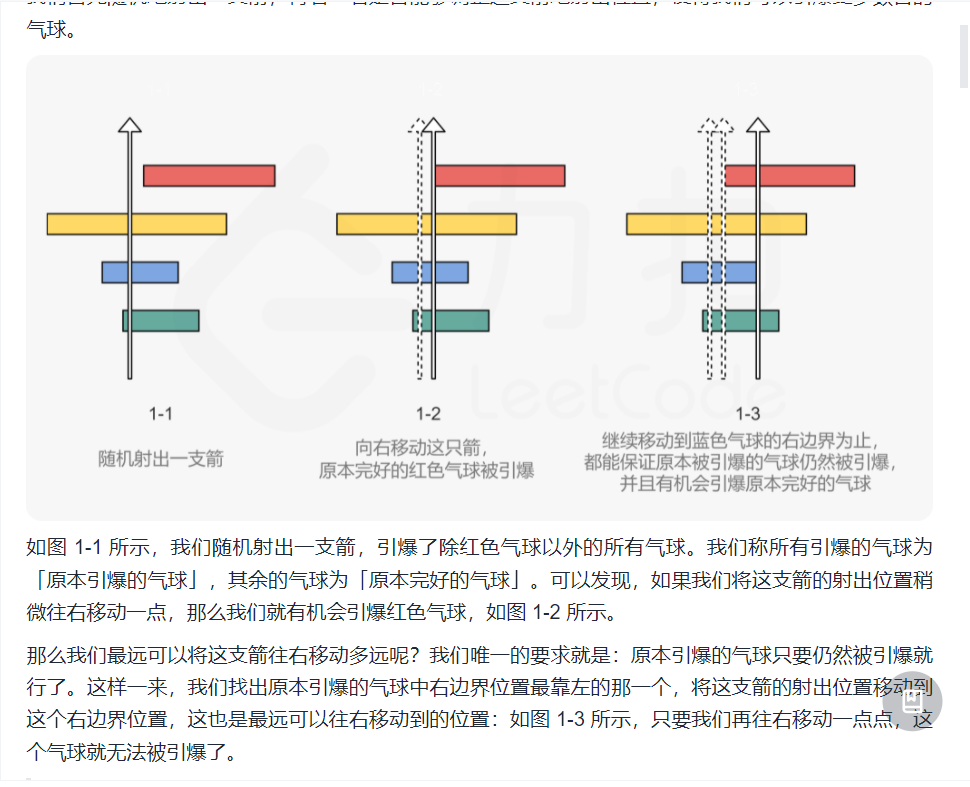
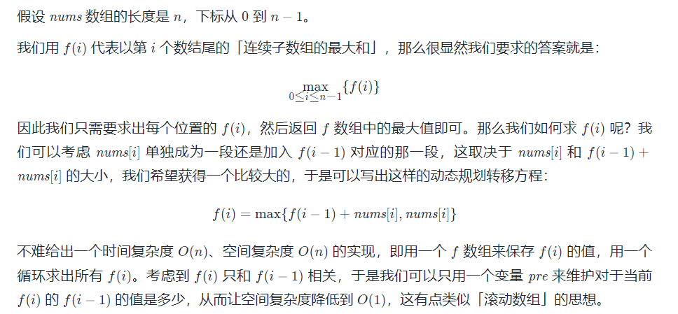
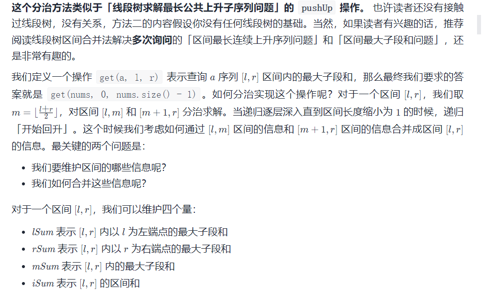
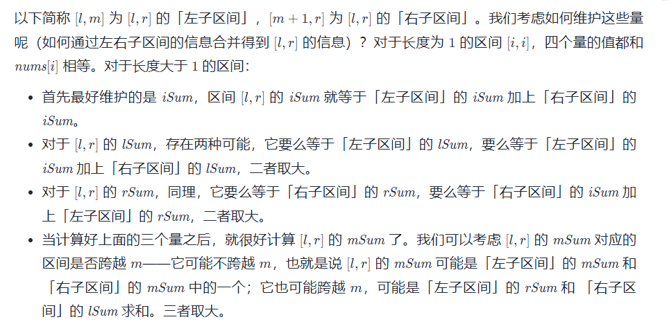

#### [605. 种花问题](https://leetcode-cn.com/problems/can-place-flowers/)

贪心算法，在原数组头尾各加一个0，遍历数组，若该位置前后及其自己都是零，则将其置一，表示这里可以种一朵花

```python
class Solution:
    def canPlaceFlowers(self, flowerbed: List[int], n: int) -> bool:
        if n == 0:
            return True
        temp = [0] + flowerbed + [0]
        count = 0
        for i in range(1, len(temp) - 1):
            if temp[i-1] == 0 and temp[i] == 0 and temp[i+1] == 0:
                count += 1
                temp[i] = 1
            if count == n:
                return True
        return False
```

#### [121. 买卖股票的最佳时机](https://leetcode-cn.com/problems/best-time-to-buy-and-sell-stock/)

动态规划，$前i天最大收益=max\{前i-1天最大收益，第i天价格-前i-1天最低价格\}$

`DP[i] = max( DP[i-1], prices[i] - min)`

```C++
class Solution {
public:
    int maxProfit(vector<int>& prices) {
        int lenth=prices.size(), min=prices[0], max=0;
        prices[0] = 0;
        for(int i=1; i<lenth; i++)
        {
            int price = prices[i];
            prices[i] = (prices[i-1] > prices[i] - min) ? prices[i-1] : prices[i] - min;
            min = (price < min) ? price : min;
            max = (prices[i] > max) ? prices[i] : max;
        }
        return max;
    }   
};
```

#### [122. 买卖股票的最佳时机 II](https://leetcode-cn.com/problems/best-time-to-buy-and-sell-stock-ii/)

脑筋急转弯，只要今天的价格比昨天的高，就可以交易

```C++
class Solution {
public:
    int maxProfit(vector<int>& prices) {
        int lenth=prices.size(), result=0;
        for(int i=0; i<lenth-1; i++)
            if(prices[i] < prices[i+1])
                result += prices[i+1] - prices[i];
        return result;
    }
};
```

#### [561. 数组拆分 I](https://leetcode-cn.com/problems/array-partition-i/)

先排序，然后从头两两分组，将较小值加入即可

```C++
class Solution {
public:
    int arrayPairSum(vector<int>& nums) {
        sort(nums.begin(), nums.end());
        int lenth=nums.size(), result=0;
        for(int i=0; i<lenth; i+=2)
            result += nums[i];
        return result;
    }
};
```

#### [455. 分发饼干](https://leetcode-cn.com/problems/assign-cookies/)

先排序，尽可能用小饼干满足胃口小的孩子

```C++
class Solution {
public:
    int findContentChildren(vector<int>& g, vector<int>& s) {
        sort(g.begin(), g.end());
        sort(s.begin(), s.end());
        int i=0, j=0, glen=g.size(), slen=s.size(), result=0;
        while(i<glen && j<slen)
        {
            if(g[i] <= s[j])
            {
                i++;
                j++;
                result++;
            }
            else
                j++;
        }
        return result;
    }
};
```

#### [575. 分糖果](https://leetcode-cn.com/problems/distribute-candies/)

假设有`n`个糖果，`m`种类型，则结果为`min(n/2, m)`

```C++
class Solution {
public:
    int distributeCandies(vector<int>& candyType) {
        unordered_set<int> candy_set(candyType.begin(), candyType.end());
        return min(candy_set.size(), candyType.size()/2);
    }
};
```

#### [135. 分发糖果](https://leetcode-cn.com/problems/candy/)

从左到右扫描，碰到上升的糖果数为前一个加一；

从右到左扫描，同理

结果为相同位置的较大值之和

```C++
class Solution {
public:
    int candy(vector<int>& ratings) {
        int lenth=ratings.size(), result=0;
        vector<int> left(lenth, 1);
        vector<int> right(lenth, 1);
        for(int i=1; i<lenth; i++)
            left[i] = (ratings[i] > ratings[i-1]) ? left[i-1] + 1 : 1;
        for(int i=lenth-2; i>=0; i--)
            right[i] = (ratings[i] > ratings[i+1]) ? right[i+1] + 1 : 1;
        for(int i=0; i<lenth; i++)
            result += max(left[i], right[i]);
        return result;
    }
};
```

#### [409. 最长回文串](https://leetcode-cn.com/problems/longest-palindrome/)

设置计数字典，若某个字母出现次数为偶数，可以全部用来凑成回文串；但是，在所有奇数个的字母中，只能选一个全部加入（中间位），其余的必须去掉一个

```python
class Solution:
    def longestPalindrome(self, s: str) -> int:
        count = {}
        for i in s:
            if i in count:
                count[i] += 1
            else:
                count[i] = 1
        flag = False
        result = 0
        for v in count.values():
            if v % 2 == 1:
                flag = True
            result += (v // 2) * 2
        if flag:
            result += 1
        return result
```

#### [621. 任务调度器(*)](https://leetcode-cn.com/problems/task-scheduler/)

```python
class Solution:
    def leastInterval(self, tasks: List[str], n: int) -> int:
        freq = collections.Counter(tasks)

        # 最多的执行次数
        maxExec = max(freq.values())
        # 具有最多执行次数的任务数量
        maxCount = sum(1 for v in freq.values() if v == maxExec)

        return max((maxExec - 1) * (n + 1) + maxCount, len(tasks))
```

#### [179. 最大数(*)](https://leetcode-cn.com/problems/largest-number/)

对于两个数`x,y`比较`x-y`和`y-x`大小，较大的放左边（高位）

```C++
class Solution {
public:
    string largestNumber(vector<int> &nums) {
        sort(nums.begin(), nums.end(), [](const int &x, const int &y) {
            long sx = 10, sy = 10;
            while (sx <= x) {
                sx *= 10;
            }
            while (sy <= y) {
                sy *= 10;
            }
            return sy * x + y > sx * y + x;
        });
        if (nums[0] == 0) {
            return "0";
        }
        string ret;
        for (int &x : nums) {
            ret += to_string(x);
        }
        return ret;
    }
};
```

#### [56. 合并区间(*)](https://leetcode-cn.com/problems/merge-intervals/)


```python
class Solution:
    def merge(self, intervals: List[List[int]]) -> List[List[int]]:
        intervals.sort(key=lambda x: x[0])

        merged = []
        for interval in intervals:
            # 如果列表为空，或者当前区间与上一区间不重合，直接添加
            if not merged or merged[-1][1] < interval[0]:
                merged.append(interval)
            else:
                # 否则的话，我们就可以与上一区间进行合并
                merged[-1][1] = max(merged[-1][1], interval[1])

        return merged
```

#### [57. 插入区间](https://leetcode-cn.com/problems/insert-interval/)

利用上一题，将插入的区间加入到原区间组中，调用上题函数即可

```python
class Solution:
    def merge(self, intervals: List[List[int]]) -> List[List[int]]:
        intervals.sort(key=lambda x: x[0])
        merged = []
        for interval in intervals:
            # 如果列表为空，或者当前区间与上一区间不重合，直接添加
            if not merged or merged[-1][1] < interval[0]:
                merged.append(interval)
            else:
                # 否则的话，我们就可以与上一区间进行合并
                merged[-1][1] = max(merged[-1][1], interval[1])
        return merged
        
    def insert(self, intervals: List[List[int]], newInterval: List[int]) -> List[List[int]]:
        intervals.append(newInterval)
        return self.merge(intervals)
```

#### [228. 汇总区间](https://leetcode-cn.com/problems/summary-ranges/)

```python
class Solution:
    def summaryRanges(self, nums: List[int]) -> List[str]:
        if len(nums) == 0:
            return nums
        if len(nums) == 1:
            return [str(nums[0])]
        # 简化边界判断
        nums += [0]
        start = 0
        result = []
        for i in range(1, len(nums)):
            if nums[i] - nums[i-1] == 1:
                continue
            else:
                if i - 1 == start:
                    result.append(str(nums[start]))
                else:
                    temp = str(nums[start]) + "->" + str(nums[i-1])
                    result.append(temp)
                start = i
        return result
```

#### [452. 用最少数量的箭引爆气球(*)](https://leetcode-cn.com/problems/minimum-number-of-arrows-to-burst-balloons/)




```python
class Solution:
    def findMinArrowShots(self, points: List[List[int]]) -> int:
        if not points:
            return 0
        points.sort(key=lambda balloon: balloon[1])
        pos = points[0][1]
        ans = 1
        for balloon in points:
            if balloon[0] > pos:
                pos = balloon[1]
                ans += 1
        return ans
```

#### [435. 无重叠区间(*)](https://leetcode-cn.com/problems/non-overlapping-intervals/)

按照起点排序：选择结尾最短的，后面才可能连接更多的区间（如果两个区间有重叠，应该保留结尾小的） 把问题转化为最多能保留多少个区间，使他们互不重复，则按照终点排序，每个区间的结尾很重要，结尾越小，则后面越有可能容纳更多的区间。

```python
class Solution:
    def eraseOverlapIntervals(self, intervals: List[List[int]]) -> int:
        if not intervals:
            return 0
        intervals.sort(key=lambda x: x[1])
        n = len(intervals)
        right = intervals[0][1]
        ans = 1
        for i in range(1, n):
            if intervals[i][0] >= right:
                ans += 1
                right = intervals[i][1]
        return n - ans
```

#### [646. 最长数对链(*)](https://leetcode-cn.com/problems/maximum-length-of-pair-chain/)


```python
class Solution:
    def findLongestChain(self, pairs: List[List[int]]) -> int:
        pairs.sort(key = lambda x : x[1])
        result = 0
        cur = -inf
        for pair in pairs:
            if cur < pair[0]:
                cur = pair[1]
                result += 1
        return result
```

#### [406. 根据身高重建队列(*)](https://leetcode-cn.com/problems/queue-reconstruction-by-height/)

```python
class Solution:
    def reconstructQueue(self, people: List[List[int]]) -> List[List[int]]:
        people.sort(key=lambda x: (x[0], -x[1]))
        n = len(people)
        ans = [[] for _ in range(n)]
        for person in people:
            spaces = person[1] + 1
            for i in range(n):
                if not ans[i]:
                    spaces -= 1
                    if spaces == 0:
                        ans[i] = person
                        break
        return ans
```

#### [48. 旋转图像](https://leetcode-cn.com/problems/rotate-image/)

```C++
class Solution {
public:
    void rotate(vector<vector<int>>& matrix) {
        int m=matrix.size(), n=matrix[0].size();
        int i=0, j=0;
        for(i=0; i<m/2; i++)
            for(j=0; j<n; j++)
                swap(matrix[i][j], matrix[n-i-1][j]);
        for(i=0; i<m; i++)
            for(j=0; j<i; j++)
                swap(matrix[i][j], matrix[j][i]);
    }
};
```

#### [169. 多数元素](https://leetcode-cn.com/problems/majority-element/)

* 每次删除两个不同元素，剩下最后一个元素即为答案
* Boyer-Moore投票算法。从第一个数开始，令`vote=0`遇到相同的就加1，遇到不同的就减1，减到`-1`就重新换个数开始计数，总能找到最多的那个

```C++
class Solution {
public:
    int majorityElement(vector<int>& nums) {
        int lenth=nums.size(), candidate=nums[0], vote=0;
        for(auto n:nums)
        {
            if(n != candidate)
            {
                vote--;
                if(vote == -1)
                {
                    vote = 0;
                    candidate = n;
                }
            }
            else
                vote++;
        }
        return candidate;
    }
};
```

#### [215. 数组中的第K个最大元素(*)](https://leetcode-cn.com/problems/kth-largest-element-in-an-array/)

利用快速排序的交换方法

```C++
class Solution {
public:
    int quickSelect(vector<int>& a, int l, int r, int index) {
        int q = randomPartition(a, l, r);
        if (q == index) {
            return a[q];
        } else {
            return q < index ? quickSelect(a, q + 1, r, index) : quickSelect(a, l, q - 1, index);
        }
    }

    inline int randomPartition(vector<int>& a, int l, int r) {
        int i = rand() % (r - l + 1) + l;
        swap(a[i], a[r]);
        return partition(a, l, r);
    }

    inline int partition(vector<int>& a, int l, int r) {
        int x = a[r], i = l - 1;
        for (int j = l; j < r; ++j) {
            if (a[j] <= x) {
                swap(a[++i], a[j]);
            }
        }
        swap(a[i + 1], a[r]);
        return i + 1;
    }

    int findKthLargest(vector<int>& nums, int k) {
        srand(time(0));
        return quickSelect(nums, 0, nums.size() - 1, nums.size() - k);
    }
};
```

#### [75. 颜色分类!](https://leetcode-cn.com/problems/sort-colors/)

荷兰国旗算法，设置三个指针，左指针（初始化-1）、右指针（初始化`lenth`）、当前遍历位置

当前遍历位置和右指针不相等时一直执行如下循环

* 若为0，则与左指针后一个位置交换，当前指针和左指针自增；
* 若为1，当前指针自增；
* 若为2，则与右指针前一个位置交换，右指针自减，当前指针不变。

```C++
class Solution {
public:
    void sortColors(vector<int>& nums) {
        int lenth=nums.size(), left=-1, right=lenth, cur=0;
        while(cur != right)
        {
            if(nums[cur] == 0)
            {
                swap(nums[++left], nums[cur]);
                cur++;
            }
            else if(nums[cur] == 1)
                cur++;
            else
                swap(nums[--right], nums[cur]);
        }
    }
};
```

#### [324. 摆动排序 II(*)](https://leetcode-cn.com/problems/wiggle-sort-ii/)

```C++
class Solution {
public:
    void wiggleSort(vector<int>& nums) {
        int n = nums.size();
        // Find a median.
        auto midptr = nums.begin() + n / 2;
        nth_element(nums.begin(), midptr, nums.end());
        int mid = *midptr;
        // Index-rewiring.
        #define A(i) nums[(1+2*(i)) % (n|1)]
        // 3-way-partition-to-wiggly in O(n) time with O(1) space.
        int i = 0, j = 0, k = n - 1;
        while (j <= k) {
            if (A(j) > mid)
                swap(A(i++), A(j++));
            else if (A(j) < mid)
                swap(A(j), A(k--));
            else
                j++;
        }
    }
};
```

#### [517. 超级洗衣机(*)](https://leetcode-cn.com/problems/super-washing-machines/)

```C++
class Solution {
public:
    int findMinMoves(vector<int> &machines) {
        int tot = accumulate(machines.begin(), machines.end(), 0);
        int n = machines.size();
        if (tot % n) {
            return -1;
        }
        int avg = tot / n;
        int ans = 0, sum = 0;
        for (int num: machines) {
            num -= avg;
            sum += num;
            ans = max(ans, max(abs(sum), num));
        }
        return ans;
    }
};
```

#### [649. Dota2 参议院(*)](https://leetcode-cn.com/problems/dota2-senate/)

贪心算法，优先禁言下一个不同阵营的议员，因此需要两个队列

```C++
class Solution {
public:
    string predictPartyVictory(string senate) {
        int n = senate.size();
        queue<int> radiant, dire;
        for (int i = 0; i < n; ++i) {
            if (senate[i] == 'R') {
                radiant.push(i);
            }
            else {
                dire.push(i);
            }
        }
        while (!radiant.empty() && !dire.empty()) {
            if (radiant.front() < dire.front()) {
                radiant.push(radiant.front() + n);
            }
            else {
                dire.push(dire.front() + n);
            }
            radiant.pop();
            dire.pop();
        }
        return !radiant.empty() ? "Radiant" : "Dire";
    }
};
```

#### [678. 有效的括号字符串](https://leetcode-cn.com/problems/valid-parenthesis-string/)

使用栈，设置左括号和星号栈。当遇到右括号时，优先弹出左括号栈，其次弹出星号栈。

若遍历一轮之后，左括号栈不为空，则检查左括号栈顶元素是否小于星号栈顶元素（即星号在左括号后面）

```C++
class Solution {
public:
    bool checkValidString(string s) {
        stack<int> left, star;
        int lenth=s.size();
        for(int i=0; i<lenth; i++)
        {
            if(s[i] == '(')
                left.push(i);
            else if(s[i] == '*')
                star.push(i);
            else
            {
                if(!left.empty())
                    left.pop();
                else if(!star.empty())
                    star.pop();
                else
                    return false;
            }
        }
        while(!left.empty())
        {
            if(star.empty())
                return false;
            else if(star.top() < left.top())
                return false;
            else
            {
                star.pop();
                left.pop();
            }
        }
        return true;
    }
};
```

#### [420. 强密码检验器(*)](https://leetcode-cn.com/problems/strong-password-checker/)

```C++
class Solution {

public:
    int strongPasswordChecker(string str) {
        // 统计小写字符
        int lowerCase = 0;
        // 统计大写字符
        int upwerCase = 0;
        // 统计数字
        int number = 0;
        
        // 统计连续字符出现的位置
        vector<array<int,2>>sameChars;

        if (str.length() == 0) {
            return 6;
        }
        // 记露连续出现的字符
        int st=-1;
        int en=-1;
        char pre='\0';

        for (int i = 0; i < str.length(); i++) {
            if (str[i] >= 'a' && str[i] <= 'z') {
                lowerCase++;
            } else if (str[i] >= 'A' && str[i] <= 'Z') {
                upwerCase++;
            } else if (str[i] >= '0' && str[i] <= '9') {
                number++;
            }
            if (pre != str[i]) {
                if (en - st >= 2) {
                    sameChars.push_back({st,en});
                }
                pre = str[i];
                st = i;
                en = i;
            } else {
                en = i;
            }
        }
        if (en - st >= 2) {
            sameChars.push_back({st, en});
        }
      
        // 缺失的类型. 只可能是1 or 2
        int needType = count0(lowerCase, upwerCase, number);
        // 连续的字符出现的要消除的个数 连续值-2
        vector<int>chages(sameChars.size());

        for (int j = 0; j < sameChars.size(); j++) {
            chages[j] = sameChars[j][1] - sameChars[j][0] - 1;
        }
        int res = 0;
        // 如果长度小于6 , 很简单 要补的字符和缺失的类型择大
        if (str.length() < 6) {
            return max((int)(6 - str.length()), needType);
        }
        // 删除的时候 要有优先概念
        if (str.length() > 20) {
            int index = -1;
            while (needType > 0 && (index = find(chages, 0)) > -1) {
                chages[index] = max(chages[index] - 3, 0);
                
                res++;
                
                needType--;
                //cout<<index<<" "<<chages[index]<<" "<<res<<" "<<needType<<endl;
            }
            int d = str.length() - 20;
            while (d > 0 && (index = find(chages, 1)) > -1) {
                d--;
                res++;
                chages[index]--;
            }
            int n = 0;
            for (int l = 0; l < chages.size(); l++) {
                n += chages[l] % 3 == 0 ? chages[l] / 3 : chages[l] / 3 + 1;
            }
            return res + d + needType + n;
        }
        int n = 0;
        for (int l = 0; l < chages.size(); l++) {
            n += chages[l] % 3 == 0 ? chages[l] / 3 : chages[l] / 3 + 1;
        }
        return max(n, needType);
    }

    int count0(int a,int b,int c) {
        int n = 0;
        if(a==0)n++;
        if(b==0)n++;
        if(c==0)n++;
        return n;
    }

    int find(vector<int>& array, int n) {
        int n0 = -1;
        int n1 = -1;
        int n2 = -1;
        for (int i = 0; i < array.size(); i++) {
            if (array[i] > 0 && array[i] % 3 == 0) {
                if(n0!=-1&&array[i]>array[n0]){
                    n0 = i;
                }
                if(n0==-1){
                    n0=i;
                }
                
            }
            if (array[i] > 0 && array[i] % 3 == 1) {
                if(n1!=-1&&array[i]>array[n1]){
                    n1 = i;
                }
                if(n1==-1){
                    n1=i;
                }
            }
            if (array[i] > 0 && array[i] % 3 == 2) {
                if(n2!=-1&&array[i]>array[n2]){
                    n2 = i;
                }
                
                if(n2==-1){
                    n2=i;
                }
            }
        }
        if (n == 0) {
            return n0 > -1 ? n0 : (n2 > -1 ? n2 : n1);
        }
        if (n == 1) {
            return n1 > -1 ? n1 : (n2 > -1 ? n2 : n0);
        }
        return -1;
    }
};
```

#### [53. 最大子数组和](https://leetcode-cn.com/problems/maximum-subarray/)

* 法一，动态规划

	

* 法二，分治法

	

```C++
class Solution {
public:
    int maxSubArray(vector<int>& nums) {
        int presum=0, result=nums[0], lenth=nums.size();
        for(auto n:nums)
        {
            presum = (presum < 0) ? n : presum + n;
            result = (result > presum) ? result : presum;
        }
        return result;
    }
};
```

